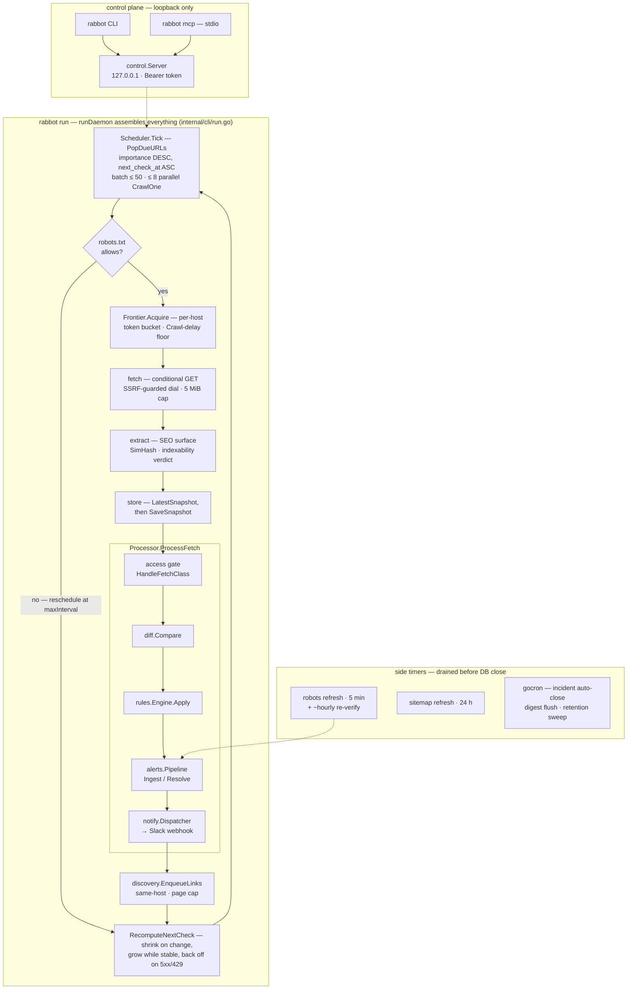

# Architecture

Rabbot-SEO is a single static Go binary that runs 24/7 as a daemon, rechecking the
pages of your sites on an adaptive per-URL cadence and alerting (Slack) when the SEO
surface regresses. Everything lives in one process and one SQLite file; the same
binary is also the CLI and an MCP server, so a human or an LLM can drive the running
daemon over its loopback control plane. This is the system on one page: how a
single recheck flows, the package codemap, and the invariants the code holds.

## How a recheck flows

The same flow in prose:

1. **Assembly.** `runDaemon` (`internal/cli/run.go`) is the single composition point:
   it opens the store, then builds robots cache → frontier → fetcher → extractor →
   discoverer → alerting stack (`supervisor.BuildAlertingStack`) → crawler →
   scheduler → side timers → control server. `rabbot run` runs it in the foreground;
   `rabbot service install` registers an OS service that executes `rabbot run`
   under `kardianos/service` (`supervisor.Daemon`).
2. **Due-pop.** `scheduler.Scheduler.Tick` calls `PopDueURLs` (importance DESC,
   `next_check_at` ASC, in UTC), takes a batch of up to 50 and dispatches up to 8
   parallel `Crawler.CrawlOne` goroutines.
3. **Politeness gate.** `CrawlOne` (`internal/scheduler/crawl.go`) first checks
   robots: a disallowed URL is rescheduled at `maxInterval` (no busy loop). A robots
   `Crawl-delay` becomes a hard per-host spacing floor (`Frontier.SetMinInterval`);
   then `Frontier.Acquire(host)` blocks on the per-host token bucket
   (`golang.org/x/time/rate`) and concurrency cap.
4. **Fetch.** The fetcher issues a conditional GET (ETag/Last-Modified), captures
   the full redirect chain, dials through an SSRF guard, caps bodies at 5 MiB, and
   sends the per-host User-Agent trust signal. `Frontier.Report` feeds latency and
   backoff classes into adaptive throttling.
5. **Extract & persist.** OK fetches with a body run `extract.Extractor.Extract`
   (the SEO surface plus SimHash and an indexability verdict; an unparseable DOM
   degrades honestly via `ErrDOMTooDeep` instead of vanishing). `LatestSnapshot` is
   read **before** `SaveSnapshot` so the diff runs against the prior snapshot.
6. **Process.** `Processor.ProcessFetch` (`internal/scheduler/process.go`) runs the
   spine: the access gate (`alerts.Pipeline.HandleFetchClass` — a non-OK fetch
   suppresses SEO emission and raises/maintains a `monitoring_*` incident) →
   `diff.Compare` (per-field changes; SimHash Hamming distance splits cosmetic from
   substantive) → `RecordChanges` → `rules.Engine.Apply` (findings keyed
   `(url_id, rule_id)`, opened and closed) → the new-finding bridge →
   `alerts.Pipeline.Ingest`/`Resolve` (fingerprint dedup, incident members,
   throttle/digest buffering) → `notify.Dispatcher` → the Slack Block Kit webhook
   (`internal/notify/slack.go`).
7. **Discover.** `discovery.Discoverer.EnqueueLinks` follows same-host links from
   the page, bounded by the per-site page cap and the verification-aware budget.
8. **Reschedule.** `RecomputeNextCheck` shrinks the interval toward `minInterval`
   on a substantive change and grows it while the page is stable;
   blocked/unreachable/5xx fetches take `backoffSchedule` instead (Retry-After
   honored on soft blocks). `UpdateURLSchedule` persists `next_check_at`, the
   interval, and the conditional-GET validators.

## Side loops

All side loops are tied to the daemon context and drained before the DB closes
(`internal/cli/run.go`) — the goroutine timers join through `pipelineWG`, the
gocron jobs through gocron's own `Shutdown`:

- **Robots refresh** — every 5 minutes, `scheduler.SideTimers.RefreshRobots`
  re-fetches each enabled site's robots.txt, diffs it as a file snapshot, and feeds the same
  alerts pipeline. Every ~12th tick (~hourly) piggybacks a re-verify pass over site
  verification (demote-only; reinstalls throttle floors).
- **Sitemap refresh** — default every 24 h (live-reloadable), re-runs
  `SeedSitemaps` per enabled site so newly published URLs are discovered; dedup
  keeps existing schedules untouched.
- **gocron jobs** — incident auto-close (24 h sweep), digest flush, and the
  retention sweep that trims old snapshots so the SQLite file stays small.

## Control plane and read paths

`control.Server` (`internal/control`) binds `127.0.0.1` only — never `0.0.0.0` —
and authenticates every request with a Bearer token compared in constant time
(`subtle.ConstantTimeCompare`); the token file is created `0600`. Its clients:

- **CLI live/action verbs** (`status`, `crawl`, `pause`, `verify`, …) go through
  the control client while the daemon runs — it stays the only live writer.
  `verify` and `db compact` fall back to direct store access only after
  confirming the daemon is down.
- **`rabbot mcp`** is a stdio-only MCP server whose `controlBridge` talks to the
  same loopback endpoints; the MCP child process opens no database.
- **Read-only CLI verbs** (`inspect`, `report`, `history`) open the store directly:
  WAL allows concurrent readers beside the daemon's single writer.

## Codemap — `internal/`

| Package | One line |
|---|---|
| `alerts` | Incident state machine: dedup, grouping, throttle/digest buffering, auto-close; `monitoring_*` incidents on bad fetches. |
| `behavior` | Synthetic per-site-type behavioral regression matrix (275 scenarios across the 6 site types) + fuzz targets driving `diff.Compare` → `rules.Engine.Apply`; locks the signal/noise profile so it cannot silently drift. Test/dev only, never shipped. |
| `benchcorpus` | Deterministic, dependency-free synthetic-HTML corpus generator (test/dev only, never shipped); shared by the B3 microbenches and the capacity harness. |
| `cli` | Cobra command tree; read-only verbs open the store, mutating verbs call the control client (daemon-down fallbacks open it directly). |
| `config` | Config schema; koanf load/merge/validate: defaults → file → `RABBOT_` env → flags. |
| `control` | Loopback HTTP control plane (server + client), Bearer-token auth, `127.0.0.1` only. |
| `coverage` | Pure, deterministic crawl-pass time/disk estimator shared by `doctor`, `init`, and the wizard. |
| `diff` | Snapshot comparison → `model.Change`; SimHash Hamming distance classifies cosmetic vs substantive. |
| `discovery` | Sitemap expansion (robots directive, index, gzip) + bounded same-host link-following; owns the over-fetch bounds. |
| `extract` | HTML → SEO snapshot: title/meta/robots/canonical/hreflang/headings/OG/JSON-LD, SimHash, indexability verdict. |
| `fetcher` | net/http fetching: redirect chain, timing, fetch-class taxonomy, conditional GET, SSRF-guarded egress, body cap. |
| `frontier` | Per-host politeness: token-bucket rate + concurrency + `Crawl-delay` floors; robots cache (RFC 9309). |
| `fsatomic` | Crash-atomic, power-loss-durable file writes for config and secret-adjacent files. |
| `gsc` | Hand-rolled Google Search Console client (sites.list, searchAnalytics.query, urlInspection.index.inspect) over net/http plus both BYO auth flows — service-account JWT (stdlib RS256) and OAuth2 installed-app refresh token; no heavy generated client, `CGO_ENABLED=0` preserved. Credentials live in `0600` files, never logged. |
| `humanize` | Tiny stdlib-only display-format helpers shared byte-for-byte by `cli` and `wizard`. |
| `hostinfo` | Best-effort, build-tagged battery probe ("does this host sleep?") for the wizard's laptop sleep-nudge; pure-Go, no network, false on any error. |
| `hydration` | Bounded, hand-rolled decoders for framework hydration payloads (`__NEXT_DATA__` JSON, `__NUXT_DATA__` devalue, RSC `__next_f` flight); recovers SEO fields without rendering. Pure stdlib + goquery, size-capped, fuzzed. |
| `linkgraph` | Link-graph LITE: incremental out-edge sync on the crawl path, cross-URL signals (`page_orphaned`/`inlink_loss`/`click_depth_regression`) from the edge delta + a depth-capped recursive-CTE BFS sweep, and the bounded `get_link_graph` export. Ship the questions, not the graph — the agent draws. |
| `mcp` | Stdio-only MCP server (package `mcpsrv`): read + safe-actions catalog over the control client. |
| `model` | Shared entities, enums, and operational constants; no behavior, no internal deps. |
| `notify` | Notifier interface, route-aware registry/dispatcher, Slack Incoming-Webhook backend (Block Kit). |
| `obs` | Structured slog logging (rotating file writer, canonical attribute keys) plus a bounded Prometheus metric set and a read-only, GET-only `/metrics` listener (off by default; loopback when enabled) with its provisioned Grafana bundle. |
| `precheck` | Pure-Go preflight for a URL: doctor checks plus a calibrated JS-dependency hint (hydration-payload aware). |
| `renderer` | The JS-rendering interface as a deliberate no-op; the binary never imports a headless engine. |
| `richresult` | Pure, stdlib-only validator of stored JSON-LD against a versioned Google rich-result requirement profile (`grr-2026.06`); presence-driven, no network, no rendering. |
| `robotsmeta` | Canonical robots-directive parser (`<meta robots>` + `X-Robots-Tag`): user-agent-prefix strip, token split, `noindex`/`none` recognition; shared by `extract` and `rules` so the indexability verdict and the alert rules can never drift. |
| `rules` | Default zero-config SEO rule set; opens/closes issues keyed `(url_id, rule_id)` with weighted impact. |
| `scheduler` | The recheck engine: due-pop loop, `CrawlOne`, `ProcessFetch` spine, side timers, adaptive rescheduling. |
| `segments` | Per-site URL classifiers compiled from config (anchored path regexps); in-memory registry for hot-path membership lookups and alert-route segment keys. |
| `serpwidth` | Stdlib-only rendered-pixel-width metric for SERP title/description fit; a static Arial advance table, no font binary. |
| `setup` | UI-agnostic first-run plan (build, validate, apply) shared by the wizard and the headless flags path. |
| `store` | All SQLite access: a single writer plus a WAL read pool, contract PRAGMAs, embedded migrations. |
| `supervisor` | OS-service lifecycle (`kardianos/service`), root context, alerting-stack wiring. |
| `urlx` | Dependency-free host-scoped URL comparison; the single owner of "same host?". |
| `verify` | Proof-of-control verification (well-known file, DNS TXT, meta tag) with instance-bound tokens. |
| `wizard` | Charm TUI onboarding front-end for `rabbot init`; collects inputs and assembles a `setup.Plan`. |

## Invariants

- **`CGO_ENABLED=0`, always.** One pure-Go static binary per OS; SQLite is
  `modernc.org/sqlite`. No cgo dependency, ever.
- **One writer.** The store serializes writes through a single writer connection
  (`BEGIN IMMEDIATE`); WAL lets any number of readers (read-only CLI verbs, the
  daemon's own read pool) run beside it.
- **Forward-only migrations.** Embedded at `internal/store/migrations/NNNN_name.sql`,
  applied in lexical order, tracked in `schema_migrations`; an applied migration is
  never edited — schema changes are a new file.
- **Loopback-only control.** The control server never leaves `127.0.0.1`; every
  mutation requires the Bearer token; remote use is SSH to the box, not an open port.
- **JS: recover, don't render.** No headless browser. `precheck` parses hydration
  payloads (`__NEXT_DATA__`/`__NUXT_DATA__`) and emits an honest hint about
  JS-dependency; a present payload or server-rendered head means the content is
  recoverable without executing JS.
- **Politeness is structural.** robots.txt compliance, `Crawl-delay` as a hard
  floor, per-host rate/concurrency limits, and verification-gated speed-ups all
  live in the crawl path itself, not in configuration discipline.

## Going deeper

- JS-rendering decision — why the binary refuses to render JavaScript and recovers
  your content anyway: [`docs/recover-dont-render.md`](docs/recover-dont-render.md)
- Operator guides — configuration, crawl speed, verification, Claude/MCP, VPS:
  [`docs/`](docs/) (deployment lives in [`docs/vps.md`](docs/vps.md))
- Engineering conventions, commands, and layout: [`CLAUDE.md`](CLAUDE.md)
