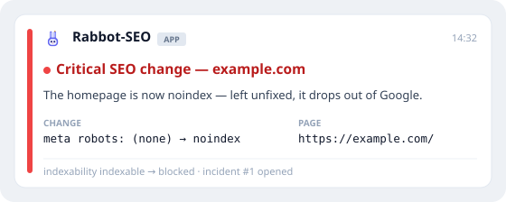

<div align="center">


**A little robot rabbit that watches your SEO so you don't have to —
and pings your Slack the moment a page regresses.**

[](https://github.com/roberto-grasiano/rabbot-seo/releases)
[](https://github.com/roberto-grasiano/rabbot-seo/actions/workflows/ci.yaml)
[](https://codecov.io/gh/roberto-grasiano/rabbot-seo)
[](https://goreportcard.com/report/github.com/roberto-grasiano/rabbot-seo)
[](https://pkg.go.dev/github.com/roberto-grasiano/rabbot-seo)
[](LICENSE)


</div>

Rabbot-SEO is a single small Go binary that keeps an eye on your site around the clock. When
something that quietly wrecks your search ranking changes — a page slips to `noindex`, a
canonical vanishes, a title or `<h1>` mutates, a page starts throwing 5xx — Rabbot-SEO catches
it on its next pass and tells you in Slack, usually long before Google does. It's
self-hosted and dependency-free at runtime: state lives in a local SQLite file, there's no
SaaS, no subscription, and nothing to run but Rabbot-SEO itself. And you barely need the
terminal: **connect it to Claude and run the whole thing just by chatting** (see below).

> I named it Rabbot-SEO — a rabbit crossed with a robot, keeping watch over your SEO.
> I've always had a soft spot for rabbits: my first pet was one, and these days one
> lives on my neck. 🐰

## 🐰 What it watches

Every recheck captures the whole SEO surface of a page — title, meta description, `robots`
directives, canonical, `hreflang`, the full heading outline, link and image counts, Open
Graph / Twitter / JSON-LD, word count, the redirect chain, and a computed **indexability
verdict** — then diffs it against last time. Critical regressions (a `noindex`, a lost
canonical, a 4xx/5xx, an indexability flip) alert immediately; smaller edits (title,
description, `h1`) alert in real time too, up to a per-recipient hourly cap — once a noisy
hour trips that cap, the overflow rolls into a periodic digest instead of stampeding your
channel. That's the whole job: catch the change that costs you traffic, and say something.

## See it in action



```text
Doctor report for https://example.com
Verdict: GREEN
The SEO content is in the server's HTML — fully recoverable without a browser.

Preflight:
  homepage status: 200
  fetch class:     ok
  robots:          allowed (status 200)

Rendering check:
  render mode:     server_rendered (confidence: high)
  visible words:   1843
  script bytes:    20480

Coverage: ~1,200 pages · ~1.00 req/s · full pass ≈ 20m · ~14.0 MB on disk (go faster by verifying ownership + raising speed). Rechecks every ~15m.
```

## Two surfaces, on purpose

Most monitors hand you a dashboard and quietly make *you* the polling loop. Rabbot-SEO bets
the other way — as agents get capable, the screen matters less — so it's built around **two
surfaces for humans**, and everything else is optional:

- **Slack — it tells you.** When a page regresses, the alert comes to *you*, in real time.
  No tab to keep open, nothing to remember to check.
- **An agent — you ask it.** Connect Claude once over [MCP](docs/claude-mcp.md) and you run
  the whole monitor by chatting — *"what changed this week?"*, *"is the homepage still
  indexable?"*, *"draw this 404's blast radius"* — and it takes safe, **confirmed** actions.

The CLI is the bedrock both rest on, and there's a [Grafana dashboard](docs/observability.md)
and a live TUI if you *want* a screen — but you shouldn't need one. **Slack pushes; an agent
answers.**

## 🤖 The easy way — run it through Claude

You shouldn't have to babysit a CLI. Rabbot-SEO is built to be **driven by an LLM** — point
Claude at it once, and from then on you just *talk* to your SEO monitor.

**Set it up.** Paste this into [Claude Code](https://claude.com/claude-code) (or Claude
Desktop with shell access):

> **Set up Rabbot-SEO for me.** Read
> `https://github.com/roberto-grasiano/rabbot-seo/blob/main/docs/install-with-claude.md`
> and follow it: detect my OS, install `rabbot` the best way for my system, get
> `https://MY-SITE.com` monitored, and connect yourself to it over MCP. Ask me anything
> you need.

Claude detects your environment, installs Rabbot-SEO through the right channel, gets your
first site monitored, can set up the 24/7 service, and **wires itself up over MCP** —
checking in with you at each step.

**Then just ask.** Once connected, you run the whole monitor from inside Claude:

> *"What changed on my site this week?"* — *"Add my staging site."* — *"Is the homepage
> still indexable?"* — *"Verify ownership of example.com."* — *"Mute that issue."*

Rabbot-SEO answers with status, history, issues, and a cross-site digest, and takes safe,
**confirmed** actions (every change asks first). It works against a local daemon or one on
a VPS, over SSH. Full tool catalog → **[Claude / MCP](docs/claude-mcp.md)**.

> Rabbot-SEO speaks the open **[Model Context Protocol](https://modelcontextprotocol.io)**, so
> any MCP-capable client can connect — Claude is the paved path.

## Prefer to drive it yourself?

Rabbot-SEO is one static binary with no runtime dependencies — install it and use the CLI
directly. Pick your platform:

| Platform | Install |
|---|---|
| **macOS / Linux** — Homebrew | `brew install roberto-grasiano/rabbot-seo/rabbot` |
| **Windows** — Scoop | `scoop bucket add rabbot-seo https://github.com/roberto-grasiano/scoop-rabbot-seo`<br>`scoop install rabbot` |
| **Linux / macOS** — script | `curl -fsSL https://raw.githubusercontent.com/roberto-grasiano/rabbot-seo/main/install.sh \| sh` |
| **Docker** | `docker pull ghcr.io/roberto-grasiano/rabbot-seo:latest` |
| **From source** — Go ≥ 1.26.3 | `go install github.com/roberto-grasiano/rabbot-seo/cmd/rabbot@latest` |

Then run `rabbot init` and answer three plain questions — *what site do you want to watch*,
*you're allowed to, right?*, and *a contact email* — and Rabbot-SEO writes its config, starts
watching (politely, throttled until you verify ownership), and shows you what it just read:

```sh
rabbot init
# ...or headless / CI, in one line:
rabbot init --contact-email you@you.example --site https://example.com --i-am-authorized --start
```

From any shell:

```sh
rabbot status                       # counts, queue, last-crawl time
rabbot inspect https://example.com  # everything Rabbot-SEO knows about one URL
rabbot history https://example.com  # the change log for a URL
rabbot report                       # a cross-site "what changed lately" digest
```

Confirm the install with `rabbot version`; pre-built packages ship with each
[release](https://github.com/roberto-grasiano/rabbot-seo/releases), Sigstore-signed with
a per-archive SBOM ([verify a download](docs/RELEASING.md#verify-a-download)). The
macOS/Windows binaries aren't OS-notarized, so Homebrew/Scoop clear Gatekeeper/SmartScreen
for you. Full setup and config reference: **[docs/configuration.md](docs/configuration.md)**.

## Where to run Rabbot-SEO

Real-time monitoring quietly assumes an **always-on box** — Rabbot-SEO catches a regression
on its next pass, so it has to be awake to pass. That shapes *where* to run it:

- **On your laptop** — perfect for **trying** Rabbot-SEO, and a genuinely useful setup for
  watching a **staging** or local site (catch SEO regressions before they ship to production).
  But a laptop **sleeps** when you close the lid, and monitoring pauses with it — there's a
  gap whenever it's asleep. Great for evaluation and staging; not the home for 24/7 watching.
- **On an always-on box** — to actually catch live regressions hours before Search Console
  does, give Rabbot-SEO a machine that never sleeps. It's one static binary with no runtime
  deps, so the choice is just whatever you already have:

| Run target | Good for | Guide |
|---|---|---|
| 🖥️ **VPS** (Hetzner / DigitalOcean / Hostinger) | the simplest always-on box, no hardware | [docs/vps.md](docs/vps.md) |
| 🍓 **Raspberry Pi** | a low-power home server, no cloud bill | [docs/raspberry-pi.md](docs/raspberry-pi.md) |
| 🍎 **Mac mini** | a quiet desktop you already own | [docs/mac-mini.md](docs/mac-mini.md) |
| 🐳 **Docker** | a container with `restart: unless-stopped` | [docker-compose.yml](docker-compose.yml) |

**Now vs after reboot:** the wizard (`rabbot init`) starts monitoring **now** — a detached
process that watches until you log out or the machine reboots. To keep it watching **after a
reboot**, install it as a service: `rabbot service install` (systemd on Linux, a per-user
LaunchAgent on macOS, the Service Manager on Windows). The wizard's "Keep watching 24/7" step
does exactly this.

## Get Slack alerts in 2 steps

1. In Slack, add an **Incoming Webhook** and copy its URL (treat it like a password).
2. Hand it to Rabbot-SEO, keeping the secret in your environment:

```sh
export RABBOT_SLACK_WEBHOOK='https://hooks.slack.com/services/XXX/YYY/ZZZ'
rabbot init --contact-email you@you.example --site https://example.com \
  --i-am-authorized --slack-webhook '${RABBOT_SLACK_WEBHOOK}'
```

That wires a Slack notifier plus a catch-all route and sends a test alert. The `${…}` token
is stored **verbatim** — the real URL stays in your environment and is never written to the
config or logged. Want only the serious stuff, or per-site routing? See
**[Slack routing](docs/configuration.md#slack-routing)**. *(Or just ask Claude: "set up
Slack alerts for Rabbot-SEO.")*

## What else it does

- **Whole-site discovery** — reads `robots.txt`, expands sitemap indexes (gzip-aware), and
  follows same-host links to catch orphans, all behind an SSRF check and a per-site page
  cap. → [crawl speed & coverage](docs/crawl-speed.md)
- **Sitemap watching** — rechecks each site's sitemap on a cadence and alerts when it breaks
  (a `200`→`4xx`/`5xx` regression) or when its URL set shifts (added/dropped pages, with
  before/after counts and sample paths) — a partial fetch never masquerades as a mass drop.
- **Coverage reconciliation** — reconciles what the sitemap *declares* against what's actually
  been crawled, surfacing declared-but-uncrawled and crawled-but-unlisted URLs, and alerts when
  that drift grows. Read it any time with `rabbot sitemap coverage` or the `get_coverage` tool.
- **Rich-result eligibility** — validates the JSON-LD a page already ships against a versioned
  Rabbot profile that mostly mirrors Google's rich-result requirements but adds a few deliberate
  Rabbot policy checks stricter than Google's literal wording (e.g. it flags an `Article` that
  ships no `headline` — Google lists that as recommended, not required), so a deploy that drops
  `offers` from `Product` markup (with the `@type` set unchanged, invisible to a plain diff) pages
  **critical** within one recheck interval — hours before Search Console notices. Presence-driven:
  it never suggests adding markup you don't have. → [the missing-`offers` demo](docs/rich-results-demo.md)
- **Google Search Console (read-only, self-hosted)** — connect a site to its Search Console
  property and Rabbot reads Google's own ground truth: whether a URL is **indexed**, which
  **canonical Google chose** vs the one you declared, and its **search performance**. It pages
  on only the high-signal disagreements — an index-status discrepancy or a Google-canonical
  mismatch — and correlates a change against the page's search performance after the fact;
  it deliberately **never** fires standalone traffic/ranking-drop noise. Your GSC data lands in
  your own SQLite file and never leaves the box. → [Search Console](docs/gsc.md)
- **Segments** — name the slices that matter (`/blog`, `/product`) and every surface speaks
  in those terms: route `/blog/**` alerts to `#content` and `/product/**` to `#growth`, filter
  `rabbot issues`/`report` by segment, and scope an agent's questions through MCP.
  → [segments](docs/segments.md)
- **Health score** — rolls the impact points it already scores per issue into a per-site and
  per-segment 0–100 number recorded over time; importance-weighted, page-capped, and honest
  under cold start (it shows `—`, never a fake 100, until it has seen enough of the site).
  → [the scoring model](docs/adr/0002-health-score-model.md)
- **Adaptive cadence** — each URL speeds up when it keeps changing and eases off while it's
  stable; importance orders the queue. → [crawl speed & coverage](docs/crawl-speed.md)
- **Polite by design** — a hard rate floor, `robots.txt` `Crawl-delay` always wins, and
  going faster than baseline requires proving you own the site.
  → [crawl speed & coverage](docs/crawl-speed.md)
- **Prove ownership** — `rabbot verify` (well-known file, DNS TXT, or meta tag) lifts the
  throttle to full speed. → [verification & crawler identity](docs/verification.md)
- **Look before you leap** — `rabbot doctor <url>` previews reachability, robots, an honest
  JS-rendering hint, and a crawl-size estimate. → [crawl speed & coverage](docs/crawl-speed.md)
- **Recovers JS sites without a browser** — it never renders JavaScript; it reads the
  hydration payloads frameworks ship in the HTML, grades each page's render mode, and
  reports what it genuinely can't see instead of faking it.
  → [recover, don't render](docs/recover-dont-render.md)
- **Stays small** — a background retention sweep trims old snapshots so the SQLite file
  doesn't grow forever. → [configuration](docs/configuration.md#database-retention)

## Going further

| Guide | What's in it |
|---|---|
| 🧭 [Architecture](ARCHITECTURE.md) | the system on one page — how a recheck flows, the codemap, the invariants |
| 🤖 [Claude / MCP](docs/claude-mcp.md) | the full tool catalog; connect Claude locally or over SSH |
| 🔎 [Google Search Console](docs/gsc.md) | Google's index status, chosen canonical, and search performance — read-only, on your box |
| 🚫 [Recover, don't render](docs/recover-dont-render.md) | why the binary refuses to render JS — and recovers your content anyway |
| 🐢 [Crawl speed & coverage](docs/crawl-speed.md) | request rate, the page cap, the estimator, `doctor`, being a good neighbor |
| ⚡ [Performance & capacity](docs/PERFORMANCE.md) | measured cost per page, how many URLs fit on 1 vCPU / 1 GB, reproduce it yourself |
| 🔐 [Verification & crawler identity](docs/verification.md) | prove ownership; how site owners see your crawler |
| 🖥️ [Run on a VPS](docs/vps.md) | Hetzner / DigitalOcean / Hostinger, with no inbound ports |
| 🍓 [Run on a Raspberry Pi](docs/raspberry-pi.md) | 64-bit OS, USB-SSD for SQLite, systemd, sizing |
| 🍎 [Run on a Mac mini](docs/mac-mini.md) | Homebrew, a per-user LaunchAgent, auto-login, no-sleep |
| 📊 [Self-observability](docs/observability.md) | `/metrics`, the provisioned Grafana dashboard |
| ⚙️ [Configuration](docs/configuration.md) | precedence, Slack routing, reading changes, retention |
| 🔄 [Updating Rabbot](docs/updating.md) | swap the binary, restart — data + config untouched; migrations auto-apply |
| 📦 [Releasing](docs/RELEASING.md) | how releases are cut |

## Build

```sh
make build   # CGO_ENABLED=0 static binary
make test    # go test -race ./...   (the gate)
make lint    # golangci-lint v2
```

Rabbot-SEO is a single static binary by design — `CGO_ENABLED=0`, pure-Go SQLite
(`modernc.org/sqlite`), no cgo, ever. How the system fits together is one page:
**[ARCHITECTURE.md](ARCHITECTURE.md)**. Engineering conventions and the roadmap live in
**[CLAUDE.md](CLAUDE.md)**.

## License

**[AGPL-3.0](LICENSE).** Free and open — and copyleft: anyone who runs a modified Rabbot-SEO
as a network service has to share their source too, so it can't quietly become someone
else's closed product.
