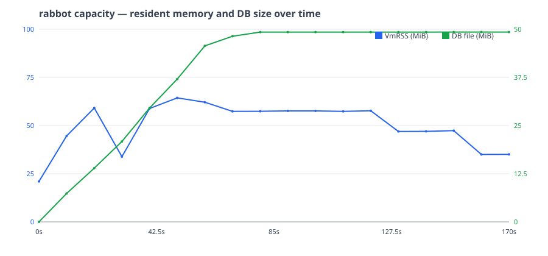

# Performance & capacity — the always-on box

Real-time SEO monitoring only works if the monitor is **awake**: Rabbot-SEO catches a
regression on its *next pass*, so it has to be passing. That assumption — a process you
leave running 24/7 — is the whole pitch, and it only holds if the process is cheap enough
that you can genuinely afford to never turn it off. Commercial real-time monitors and
enterprise crawl-analytics platforms answer that with a subscription and someone else's
infrastructure. Rabbot-SEO answers it with **one small static binary on a box you already
have** — a basic VPS, a Raspberry Pi, a Mac mini in a drawer.

That claim needs evidence, not adjectives. This page is the measured capacity story: how
much CPU one page costs to recheck, how memory and disk grow as you add URLs, and what a
single 1 vCPU / 1 GB box can actually hold. Every number here is **measured**, not
estimated — the benchmarks and the capacity sweep below produce them, and the figures are
filled in from real runs. None is invented.

> **Honesty up front.** This page reports two different things and never conflates them: the
> *pipeline CPU cost* of processing one page (a benchmark number) and the *real-world crawl
> rate* against live sites (which is deliberately politeness-bound, far slower, and covered
> in [crawl speed & coverage](crawl-speed.md)). Rabbot-SEO does **not** crawl real sites at
> benchmark speed, and this page says so loudly in [Pipeline cost is not crawl
> speed](#pipeline-cost-is-not-crawl-speed).

## Methodology

All numbers come from two harnesses that live under `scripts/bench/` and `internal/` and
**never ship in the binary** — the release builds only `./cmd/rabbot`. They measure the
shipped code, not a special build.

### A fixed corpus

The benchmarks run against a **deterministic** HTML corpus generated by construction — no
randomness anywhere, so a run is reproducible and the corpus is content-addressable. There
are three size classes, chosen to bracket the pages Rabbot-SEO sees in the wild and to stay
well under the fetcher's body cap:

| Class | Approx. size | Stands in for |
|---|---|---|
| Small | ~8 KiB | a lean landing or category page |
| Medium | ~60 KiB | a typical article with full `<head>` SEO surface |
| Heavy | ~400 KiB | a long-form / heavily-marked-up page |

Page content is derived from each page's index through fixed word tables, so the same index
always yields the same bytes. A test (`TestCorpusIsFixed`) pins the SHA-256 of each size
class: any change to the generator fails it. That falsifiability — the corpus *cannot*
silently drift — is the entire point of calling it "fixed". The heavy class (~400 KiB) is
far under the fetcher's 5 MiB body cap, so the benchmark always measures a full parse, never
a truncated prefix.

### Microbenchmarks

These isolate the hot CPU paths a recheck touches, each reporting `ns/op`, `B/op`, and
`allocs/op` (`b.ReportAllocs()` on every benchmark):

- **Extraction** (`internal/extract`) — parse the HTML and pull the full SEO surface
  (title, meta, canonical, headings, link/image counts, indexability) for each size class.
- **Main-text** (`internal/extract`) — the readability extraction and the CSS-selector
  override path.
- **Hashing** (`internal/extract`) — `ContentSHA256` and the `SimHash` near-duplicate hash
  used to classify cosmetic vs. substantive change.
- **Diff** (`internal/diff`) — comparing two snapshots, in two shapes: a no-change pair and
  an all-fields-changed pair.
- **Store** (`internal/store`) — `SaveSnapshot` (a real `BEGIN IMMEDIATE` write with WAL and
  fsync), `LatestSnapshot` (the indexed read), and `PopDueURLs` against a seeded 10,000-URL
  table (the queue read the scheduler runs every tick).

The store benchmarks open a real SQLite **file** in a temp directory — never `:memory:`.
The pure-Go `modernc.org/sqlite` write path (WAL + fsync) is the performance-sensitive design
choice this project makes deliberately, so the benchmark pays the real durable-write cost a
`:memory:` database would hide. A test (`TestSaveSnapshotBenchUsesFileDB`) pins that the
benchmark's database path ends in `.db` and exists on disk.

### Recheck-throughput benchmark

A single page-recheck is not one number — it depends on *what changed*. The
`BenchmarkRecheckPipeline` harness wires the **real** pipeline (fetcher → extract → diff →
rules → alert ingest, backed by a real store) against a loopback corpus server and measures
the three steady states a long-running monitor actually spends its time in:

| Scenario | What the server returns | Work the pipeline does |
|---|---|---|
| `not_modified` | `304` to the conditional `GET` | the cheap common case — extraction and persistence are **skipped** entirely |
| `unchanged` | identical `200` | extract + `SaveSnapshot`, diff finds **zero** change rows |
| `changed` | mutated `200` (content + title) | extract + diff + rules + alert ingest, **≥ 1** stored change row |

These three are not interchangeable, and a benchmark that silently always-304'd would
publish a fake-fast number. A guard test (`TestRecheckBenchHarness`) asserts each path does
the work it claims: `changed` produces ≥ 1 change row in the store, `unchanged` produces
zero, and `not_modified` writes no new snapshot at all. The alert webhook is a **loopback
discard endpoint** — no third-party host is ever contacted.

### How the benchmarks are run

Benchmarks run with **`CGO_ENABLED=0`** — the exact configuration of the shipped static
binary — so the numbers reflect what you actually deploy. (The race-detector test gate runs
`CGO_ENABLED=1` because `-race` requires cgo; that is the *test* path, not the benchmark
path.) Each benchmark runs `-count=10` and the results are summarized with
[`benchstat`](https://pkg.go.dev/golang.org/x/perf/cmd/benchstat), a developer tool installed
on demand — it is never a dependency of the module.

## Hardware

Capacity numbers are meaningless without the box they were measured on. Two environments are
documented, and the published **headline** is the one confirmed on the named real VPS.

### (a) Local dev / regression baseline

The day-to-day box the benchmarks and the cgroup-capped sweep run on during development:

| | |
|---|---|
| CPU | AMD Ryzen 9 7950X (16-core / 32-thread host; one core exposed under the cap) |
| RAM | 62 GiB host (capped to 1 GiB for the sweep) |
| Kernel / OS | Linux 6.6.87 (WSL2) · Ubuntu 22.04.5 LTS |
| Go version | go1.26.3 |
| `rabbot` commit | `feat/b3-benchmarks-capacity` (this PR, on `main`@`4a12440`) |
| CPU / memory cap applied | 1 vCPU / 1 GiB (via `systemd-run --scope` or `docker --cpus=1 --memory=1g`) |

This box runs the capacity sweep under a hard **1 vCPU / 1 GB cgroup cap** so the local
result tracks the target envelope. It is the **regression baseline** — what catches a perf
regression in CI and in development.

### (b) Confirmation VPS (the headline box)

The published headline is confirmed on a **named, real** entry-level cloud VPS — not a capped
local run:

| | |
|---|---|
| Provider + plan | **DigitalOcean Basic Droplet** (shared vCPU, `DO-Regular`) |
| vCPU / RAM | 1 vCPU / 1 GB |
| Disk | 24 GB SSD (~20 GB free) |
| OS / kernel | Ubuntu 24.04.4 LTS · Linux 6.8.0-71-generic |
| Go version (build) | go1.26.4 (linux/amd64) |
| `rabbot` commit | `73a926e` (`main`, 2026-06-20) |

The local cgroup-capped run and the named-VPS run measure the same 1 vCPU / 1 GB envelope
from two directions: the local cap is the **dev/regression baseline**, and the named box is
the **published confirmation**. **The confirmation run is done** (2026-06-20, on the
DigitalOcean droplet above): the headline figures below are the values measured there, with
the local capped run as consistent supporting evidence (peak RSS 59 / 60 / 58 MB locally vs
62 / 64 / 76 MB on the droplet across the same `{500, 2000, 10000}` sweep). No VPS number is
fabricated.

## Reproduce it yourself

Every command here is real and runnable from a checkout.

### Microbenchmarks + recheck throughput

```sh
make bench
```

`make bench` runs every benchmark under `CGO_ENABLED=0` with `-benchmem -count=10`, writes the
raw results to `bench.txt`, and renders a `benchstat` summary. To compare a change against a
saved baseline:

```sh
benchstat old.txt bench.txt
```

A fast compile-and-one-iteration smoke (what CI runs on every push, to keep the benchmarks
from bit-rotting) is:

```sh
CGO_ENABLED=0 go test -run '^$' -bench . -benchtime=1x ./...
```

### Capacity sweep (RSS + DB growth under a real cap)

The capacity harness runs the **real daemon** against an on-box loopback corpus server, under
a 1 vCPU / 1 GB cap, sweeping the page counts `{500, 2000, 10000}` and sampling resident
memory (`VmRSS`) and the SQLite file size over the run. It writes one `capacity-<N>.csv` per
sweep value (`elapsed_s,vmrss_kb,db_bytes`). Everything binds `127.0.0.1` only; no
third-party host is ever fetched, and the script never echoes a secret.

```sh
bash scripts/bench/capacity.sh
```

On Linux the daemon is launched under a cgroup cap via `systemd-run` (a user session is
enough):

```sh
systemd-run --user --scope --collect \
  -p MemoryMax=1G -p CPUQuota=100% \
  bash scripts/bench/capacity.sh
```

The **Docker alternative** pins the same 1 vCPU / 1 GiB envelope without systemd:

```sh
docker run --rm --cpus=1 --memory=1g \
  -v "$PWD":/src -w /src golang:1.26.4 \
  bash scripts/bench/capacity.sh
```

> **Accelerated cadence — read this.** The capacity sweep runs the daemon at a deliberately
> **accelerated recheck cadence** against the loopback corpus. That is a **stress upper
> bound** designed to push memory and disk hard in a short run — it is **not** the polite,
> default-cadence steady state, and it is **not** how Rabbot-SEO behaves against real sites
> (see [Pipeline cost is not crawl speed](#pipeline-cost-is-not-crawl-speed)). The sweep
> answers "how big does it get and does memory stay flat under sustained load", not "how fast
> does it crawl the open web".

### The memory graph

The RSS-over-time graph below is rendered from the sweep's CSV by a small dev tool:

```sh
scripts/bench/rsschart -in capacity-2000.csv -out assets/capacity-rss.svg
```

(`capacity-*.csv` is gitignored scratch; the rendered `assets/capacity-rss.svg` is the one
committed artifact.)

## Microbenchmark results

Measured with `CGO_ENABLED=0`, `-count=10`, summarized by `benchstat` on the box in
[Hardware (a)](#a-local-dev--regression-baseline). Lower is better.

### Extraction, main-text, hashing — `internal/extract`

| Benchmark | time/op | B/op | allocs/op |
|---|---|---|---|
| `Extract/small` | 654 µs | 314 KiB | 3,392 |
| `Extract/typical` | 4.11 ms | 2.07 MiB | 7,907 |
| `Extract/heavy` | 48.0 ms | 28.2 MiB | 433,400 |
| `MainText/readability` | 2.58 ms | 972 KiB | 5,100 |
| `MainText/selector` | 579 µs | 596 KiB | 1,654 |
| `ContentSHA256` | 39.8 µs | 64.1 KiB | 3 |
| `SimHash` | 489 µs | 176 KiB | 2 |

### Diff — `internal/diff`

| Benchmark | time/op | B/op | allocs/op |
|---|---|---|---|
| `Compare/no_change` | 81.1 ns | 0 | 0 |
| `Compare/all_fields_changed` | 1.56 µs | 3.78 KiB | 9 |

### Store — `internal/store`

Against a real on-disk SQLite file (WAL + fsync); `PopDueURLs` runs against a seeded
10,000-URL queue.

| Benchmark | time/op | B/op | allocs/op |
|---|---|---|---|
| `SaveSnapshot` | 643 µs | 3.11 KiB | 44 |
| `LatestSnapshot` | 399 µs | 132 KiB | 112 |
| `PopDueURLs` | 3.70 ms | 48.7 KiB | 848 |

## Recheck pipeline — cost per page by scenario

The end-to-end per-page cost (fetch → extract → diff → rules → alert ingest), broken out by
the three steady states. This is **pipeline CPU cost**, not crawl rate.

| Scenario | ms/page | B/op | allocs/op |
|---|---|---|---|
| `not_modified` (304) | 0.39 ms | 14.7 KiB | 269 |
| `unchanged` (200, no change) | 7.49 ms | 2.53 MiB | 8,881 |
| `changed` (200, mutated) | 8.08 ms | 2.79 MiB | 9,193 |

The `not_modified` case is the one a healthy site spends almost all of its time in — most
rechecks find nothing changed and the server returns `304`, so extraction and persistence are
skipped. That is the number that dominates real long-term load.

## Capacity — how many URLs fit on 1 vCPU / 1 GB

From the capacity sweep, at the accelerated stress cadence described above. Two runs of the
same `{500, 2000, 10000}` sweep — the **confirmation on the real DigitalOcean droplet**
(Hardware b, 2026-06-20) and the **local cgroup-capped baseline** (Hardware a).

**Confirmation — DigitalOcean 1 vCPU / 1 GB droplet (the published numbers):**

| URLs monitored | Peak RSS (MB) | DB size | Observations |
|---|---|---|---|
| 500 | 62 | 16 MB | full first pass; RSS peaked ~62 MB during the crawl burst |
| 2,000 | 64 | 49 MB | RSS peaked ~64 MB, far under the 1 GB cap |
| 10,000 | 76 | ~130 MB (still growing) | RSS stayed flat at ~76 MB regardless of queue size; the real core crawled more of the corpus in the 180 s window than the capped local run, so the DB is larger |

**Local cgroup-capped baseline (dev/regression):**

| URLs monitored | Peak RSS (MB) | DB size | Steady-state observations |
|---|---|---|---|
| 500 | 59 | 14 MB | full first pass; RSS peaked at ~59 MB during the crawl burst, then settled to ~34 MB |
| 2,000 | 60 | 49 MB | full first pass (DB flat by ~80 s); RSS settled to ~37 MB |
| 10,000 | 58 | 58 MB (still growing) | ~2,400 of 10,000 crawled in the 150 s window; RSS stayed flat regardless of queue size |

The two runs agree: **peak RSS holds in a tight ~60–76 MB band from 500 to 10,000 URLs, flat
regardless of queue depth** — nowhere near the 1 GB cap. The graph below is the real-VPS
2,000-URL run.



The graph shows resident memory over the run at the 2,000-URL sweep point: the question it
answers is whether memory **stays flat** under sustained load (no leak) rather than climbing
toward the cap.

## Pipeline cost is not crawl speed

This is the single most important caveat on the page, and it is the same honesty rule the
[coverage estimator](../internal/coverage/coverage.go) enforces in the product.

The recheck-pipeline number above (**~8 ms/page** to fully re-extract a 200 response; **~0.4 ms**
when a `304` short-circuits it) is the **CPU cost** of processing one page once the bytes are in
hand. It is **not** the rate at which Rabbot-SEO crawls a real
site. Against live sites the steady-state rate is **deliberately politeness-bound**:
Rabbot-SEO admits at most **one request per host every `per_host_rate`** (the 2-second
default), through a single token bucket per host. So the real crawl rate is `1 /
per_host_rate` — about **0.5 requests/second per host at the default** — regardless of how
cheap a page is to process or how many CPU cores you have. Per-host concurrency only overlaps
fetch *latency*; it never raises that admission rate.

Concretely: the pipeline can *process* a page in milliseconds, but Rabbot-SEO will still wait
its polite interval before fetching the next page from the same host. **The binary does not,
and must not, crawl at pipeline speed.** The two numbers answer two different questions —
"can this box keep up with the work?" (pipeline cost: yes, easily) and "how long does a full
pass take?" (politeness-bound: `pages / (1/per_host_rate)`, governed by your configured rate
and `robots.txt`). The full treatment — the rate floor, `Crawl-delay` precedence, verification
gating, and the on-disk footprint estimate — is in **[crawl speed &
coverage](crawl-speed.md)**.

## What this does *not* measure

To keep the numbers honest, here is what the harnesses deliberately exclude:

- **Network latency and target-site variance.** The corpus is served from loopback, so fetch
  time is near-zero and constant. Real pages have real round-trips, slow origins, redirects,
  and CDN variance — none of which a CPU-cost benchmark should pretend to model.
- **The deliberate politeness wait.** The recheck benchmark zeroes the per-host admission
  spacing so it measures *pipeline cost*, not the politeness interval. The interval is real
  and is the dominant factor in wall-clock crawl time against live sites — see
  [Pipeline cost is not crawl speed](#pipeline-cost-is-not-crawl-speed).
- **The polite default cadence.** The capacity sweep runs at an accelerated stress cadence (a
  deliberate upper bound), not the default recheck cadence a real deployment uses.

## Note: the double DOM parse (a measured, documented cost)

Extraction currently parses each page's HTML **twice**: once with `goquery` to pull the SEO
surface, and a second time inside the main-text step (the readability path re-parses the same
bytes; the CSS-selector path parses with `goquery` again). The `Extract` benchmark above
quantifies this honestly — the extraction cost includes **two full HTML parses per page**: the
main-text step that performs the second parse accounts for **~63% of `Extract`'s per-page time
(2.58 ms of 4.11 ms on the typical 60 KiB page)**, the redundant parse being the bulk of it.

This page **measures** that cost; it does not fix it. Collapsing the two parses into one is a
documented **fast-follow** — a worthwhile, well-scoped optimization that does not gate the
launch. Quantifying it first is the point: we publish the real number and the plan, rather than
quietly shipping an unmeasured inefficiency or rushing an optimization no benchmark backs.

## Headline

> **Rabbot-SEO monitors 10,000 URLs on a 1 vCPU / 1 GB box at under 80 MB peak RSS (~76 MB) —
> flat regardless of queue size — at a pipeline CPU cost of ~0.4 ms per up-to-date recheck
> (~8 ms when a page changes and is fully re-extracted).**

This headline is **confirmed on the named VPS** in
[Hardware (b)](#b-confirmation-vps-the-headline-box) — a DigitalOcean 1 vCPU / 1 GB droplet,
measured 2026-06-20 — with the **local cgroup-capped** run from
[Hardware (a)](#a-local-dev--regression-baseline) as consistent supporting evidence. The
pipeline ms/page is **CPU cost, not
crawl speed**: real crawl rate against live sites is politeness-bound at `1 / per_host_rate`
(see [Pipeline cost is not crawl speed](#pipeline-cost-is-not-crawl-speed)). That is the
counter-pitch in one line — *the infrastructure is one process you can afford to never turn
off* — backed by a measured number instead of a promise.
